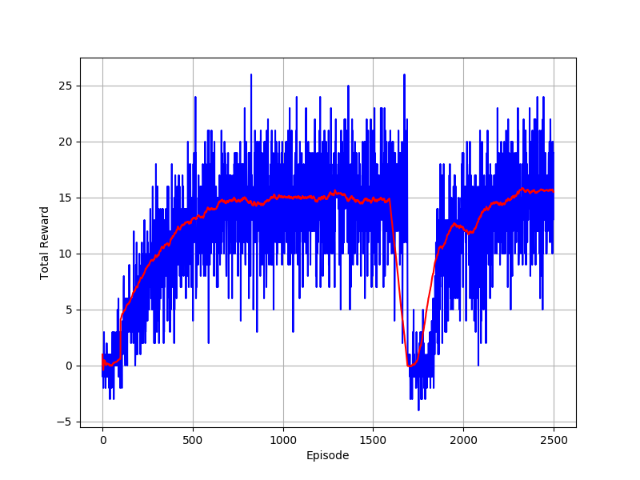

# DRL_Project01_Navigation
## Introduction
Use Deep-Q-Network to solve Unity "Banana Collector" game.

The goal of this game is to control an agent to collect **yello banana** and **aviod purple** banana.

* State: 37 dimensions
  * Contains the agent's velocity, along with ray-based perception of objects around the agent's forward direction.
* Action: 4 discrete actions
  * 0: move forward
  * 1: move backward
  * 2: turn left
  * 3: turn right
* Reward: 3 types of reward
  * Touch nothing: 0
  * Touch purple banana: -1
  * Touch yellow banana: +1
### Project basic requirement: +13 on average

## Run
1. To reproduce the result, run [Navigation.ipynb](./Navigation.ipynb)
2. To see the pretrained network's performance, run [Performance_Check.ipynb](./Performance_Check.ipynb)
3. Model related hyper-parameters were kept in [dgn_agent.py](./dqn_agent.py)
4. Network architecture were kept in [model.py](./model.py)

## Implementation details
Framework: Tensorflow v1.8   
Basic model: 2 layers multi-layer perceptron (MLP).  
Optimizer: Adam (with learning rate = 5e-4)  
#### A little modification of the code is that I trained the model for every single step. (the original code is controlled by "UPDATE_EVERY"). And the soft-updated (switch target-network's parameter) will be executed by "UPDATE_EVERY"
For more deatils, please see [implementation_and_result.pdf](./implementation_and_result.pdf)

## Result

## Future work / Ideas

