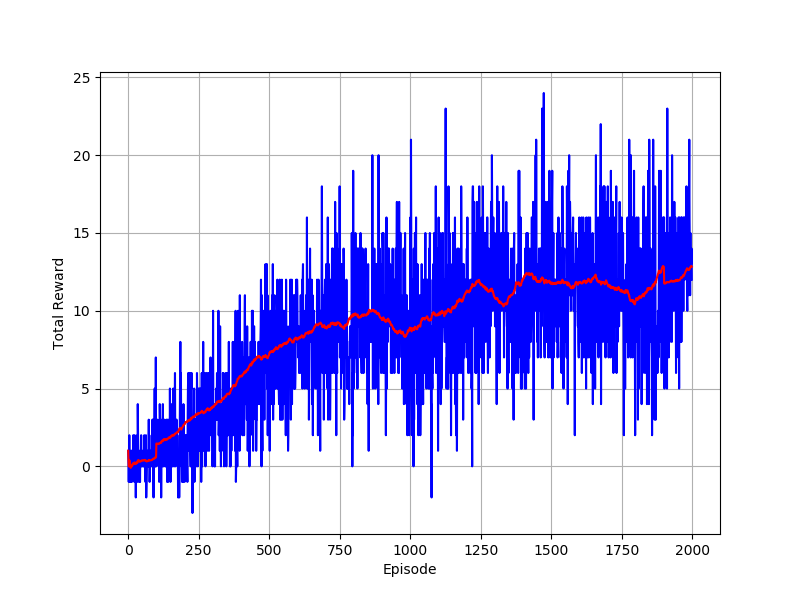
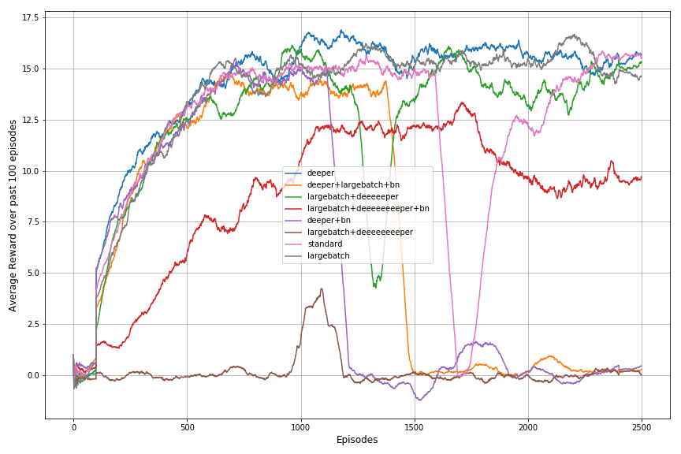

# DRL_Project01_Navigation
## Introduction
Use Deep-Q-Network to solve Unity "Banana Collector" game.

The goal of this game is to control an agent to collect **yello banana** and **aviod purple** banana.

* State: 37 dimensions
  * Contains the agent's velocity, along with ray-based perception of objects around the agent's forward direction.
* Action: 4 discrete actions
  * 0: move forward
  * 1: move backward
  * 2: turn left
  * 3: turn right
* Reward: 3 types of reward
  * Touch nothing: 0
  * Touch purple banana: -1
  * Touch yellow banana: +1
### Project basic requirement: +13 on average

## Run
1. To reproduce the result, run `python Navigation.py --numbers_of_episode 2500` or see [Navigation.py](./Navigation.py)
2. To see the pretrained network's performance, run `python Performance_Check.py`
3. Model related hyper-parameters were kept in [dgn_agent.py](./dqn_agent.py)
4. Network architecture were kept in [model.py](./model.py)

## Implementation details
Basic model: 2 layers multi-layer perceptron (MLP).  
Optimizer: Adam (with learning rate = 5e-4)  
#### A little modification of the code is that I trained the model for every single step. (the original code is controlled by "UPDATE_EVERY"). And the soft-updated (switch target-network's parameter) will be executed by "UPDATE_EVERY"
For more deatils, please see [Report.pdf](./Report.pdf)

## Result

## Ideas for Future Work
1. Implement the agent with CNN model. From my experiments, an agent with MLP design can only attain +26 reward at max, while the requested performance is +13 to +100, which means there is a lot of improvement space.
2. Stack multiple previous states as current states. It may encourage the agent to remember what's going on in previous states. When there is two bananas (or more bananas) exist at certain state, agent may force to pick up one but ignore/forget another one after pick up the banana in front of the agent. Stacking states may help agent save time from a search-pick cycle to a search-remember-pick-getMemory-pick cycle.
